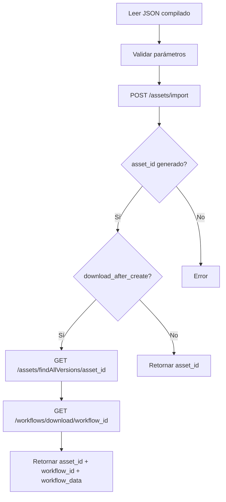
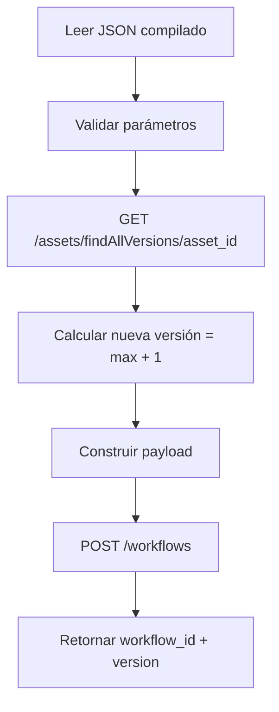

# Comandos de Creación de Workflows en Rocket

Este documento describe los comandos disponibles para crear workflows en Stratio Rocket, explicando la diferencia entre crear un nuevo asset versus crear versiones adicionales dentro de un asset existente.

## Arquitectura de Assets y Versiones

En Stratio Rocket, los workflows se organizan en dos niveles:

1. **Asset (Contenedor Maestro)**: Es el contenedor principal que agrupa todas las versiones de un workflow. Tiene un `asset_id` único (también llamado `workflowMasterId`).

2. **Workflow Version**: Es una versión específica del workflow dentro del asset. Cada versión tiene su propio `workflow_id` y número de versión incremental.

```
Asset (workflowMasterId: 3d3d44bf-96bd-4f65-b731-44f14fecdbb9)
├── Version 0 (workflow_id: a1b2c3d4...)
├── Version 1 (workflow_id: e5f6g7h8...)
└── Version 2 (workflow_id: i9j0k1l2...)
```

## Comandos Disponibles

### 1. `create_asset()` - Crear Nuevo Asset

Crea un **nuevo asset** en Rocket importando un workflow completo. Este comando genera el contenedor maestro y la primera versión del workflow.

#### Cuándo usar

- Primera vez que subes un workflow a Rocket
- Quieres crear un nuevo proyecto/pipeline completamente independiente
- No existe un asset previo para este workflow

#### Sintaxis

```python
from py2rocket import build, create_asset

# 1. Compilar el workflow local a JSON
build(workflow(), "mi_pipeline.json")

# 2. Crear asset en Rocket
result = create_asset(
    json_file="mi_pipeline.json",
    rocket_url="https://rocket.mycompany.com",
    api_token="my-cookie-token",
    project_id="196c1c2d-5dfd-4756-ba37-80aa50d0f742",
    group_id="99beb8c9-32e7-465f-9081-137cea8adee6",
    name="Pipeline de Transformación",
    description="Pipeline para procesar datos de ventas",
    verify_ssl=True,
    download_after_create=True
)

# 3. Usar los IDs generados
print(f"Asset ID: {result['asset_id']}")
print(f"Workflow ID: {result['workflow_id']}")
```

#### Parámetros

| Parámetro               | Tipo | Requerido | Descripción                                                                      |
| ----------------------- | ---- | --------- | -------------------------------------------------------------------------------- |
| `json_file`             | str  | ✅        | Ruta al archivo JSON del workflow compilado                                      |
| `rocket_url`            | str  | ✅        | URL base de Rocket (ej: https://rocket.example.com)                              |
| `api_token`             | str  | ⚠️        | Cookie de autenticación. Si no se proporciona, usa `ROCKET_AUTH_COOKIE` del .env |
| `project_id`            | str  | ⚠️        | ID del proyecto. Si no se proporciona, usa `PROJECT_ID` del .env                 |
| `group_id`              | str  | ✅        | ID del grupo/carpeta donde crear el asset                                        |
| `name`                  | str  | ❌        | Nombre del asset. Si no se proporciona, usa el nombre del workflow JSON          |
| `description`           | str  | ❌        | Descripción del asset (default: "")                                              |
| `verify_ssl`            | bool | ❌        | Verificar certificados SSL (default: True)                                       |
| `download_after_create` | bool | ❌        | Descargar workflow después de crearlo para obtener IDs (default: True)           |

#### Respuesta

```python
{
    'status': 'success',
    'asset_id': '3d3d44bf-96bd-4f65-b731-44f14fecdbb9',
    'workflow_id': 'a1b2c3d4-5e6f-7g8h-9i0j-k1l2m3n4o5p6',
    'message': 'Asset "Pipeline de Transformación" creado exitosamente',
    'response': {...},  # Respuesta completa de la API
    'workflow_data': {...}  # Datos del workflow descargado (si download_after_create=True)
}
```

#### Flujo Interno



#### Endpoint de API

```
POST /rocket/assets/import
Body:
{
  "content": "{...workflow JSON...}",
  "assetType": "SpartaWorkflow",
  "groupId": "99beb8c9-32e7-465f-9081-137cea8adee6",
  "projectId": "196c1c2d-5dfd-4756-ba37-80aa50d0f742",
  "name": "Pipeline de Transformación",
  "description": "Pipeline para procesar datos de ventas"
}
```

---

### 2. `create_workflow_version()` - Crear Nueva Versión

Crea una **nueva versión** del workflow dentro de un asset existente. Incrementa automáticamente el número de versión.

#### Cuándo usar

- Ya existe un asset en Rocket
- Quieres actualizar/modificar un workflow existente
- Necesitas mantener historial de versiones

#### Sintaxis

```python
from py2rocket import build, create_workflow_version

# 1. Compilar el workflow modificado
build(workflow(), "mi_pipeline_v2.json")

# 2. Crear nueva versión en el asset existente
result = create_workflow_version(
    json_file="mi_pipeline_v2.json",
    asset_id="3d3d44bf-96bd-4f65-b731-44f14fecdbb9",
    rocket_url="https://rocket.mycompany.com",
    api_token="my-cookie-token",
    comment="Agregada validación de datos y nuevo paso de limpieza",
    verify_ssl=True
)

# 3. Verificar la nueva versión
print(f"Versión creada: {result['version']}")
print(f"Workflow ID: {result['workflow_id']}")
```

#### Parámetros

| Parámetro    | Tipo | Requerido | Descripción                                                                      |
| ------------ | ---- | --------- | -------------------------------------------------------------------------------- |
| `json_file`  | str  | ✅        | Ruta al archivo JSON del workflow compilado                                      |
| `asset_id`   | str  | ✅        | UUID del asset (workflowMasterId) donde crear la versión                         |
| `rocket_url` | str  | ✅        | URL base de Rocket (ej: https://rocket.example.com)                              |
| `api_token`  | str  | ⚠️        | Cookie de autenticación. Si no se proporciona, usa `ROCKET_AUTH_COOKIE` del .env |
| `comment`    | str  | ❌        | Comentario asociado a esta versión (default: "")                                 |
| `verify_ssl` | bool | ❌        | Verificar certificados SSL (default: True)                                       |

#### Respuesta

```python
{
    'status': 'success',
    'workflow_id': 'e5f6g7h8-9i0j-1k2l-3m4n-5o6p7q8r9s0t',
    'version': 1,
    'asset_id': '3d3d44bf-96bd-4f65-b731-44f14fecdbb9',
    'message': 'Versión 1 creada exitosamente',
    'response': {...}  # Respuesta completa de la API
}
```

#### Flujo Interno



#### Endpoint de API

```
POST /rocket/workflows?comment=Agregada validación de datos
Body:
{
  "workflowMasterId": "3d3d44bf-96bd-4f65-b731-44f14fecdbb9",
  "settings": {...},
  "pipelineGraph": {...},
  "uiSettings": [...],
  "version": 1,
  "tags": []
}
```

---

## Comparación de Comandos

| Aspecto                 | `create_asset()`                    | `create_workflow_version()`        |
| ----------------------- | ----------------------------------- | ---------------------------------- |
| **Propósito**           | Crear nuevo asset + primera versión | Agregar versión a asset existente  |
| **Endpoint API**        | POST /assets/import                 | POST /workflows                    |
| **Requiere asset_id**   | ❌ No                               | ✅ Sí                              |
| **Requiere group_id**   | ✅ Sí                               | ❌ No (heredado del asset)         |
| **Requiere project_id** | ✅ Sí                               | ❌ No (heredado del asset)         |
| **Versionamiento**      | Crea versión 0                      | Incrementa versión automáticamente |
| **Cuándo usar**         | Primera vez                         | Actualizaciones subsecuentes       |

---

## Flujo de Trabajo Completo

### Escenario: Crear y Evolucionar un Pipeline

```python
from py2rocket import build, create_asset, create_workflow_version

# ==========================================
# PASO 1: Crear el pipeline inicial
# ==========================================
def workflow_v1():
    with pipeline(
        name="pipeline-ventas",
        execution_engine="spark",
        workflow_type="SpartaWorkflow"
    ) as pl:
        # Leer datos
        ventas = delta_input(
            path="/data/ventas",
            alias="ventas_input"
        )

        # Transformar
        result = trigger(
            inputs=[ventas],
            sql="SELECT * FROM ventas WHERE monto > 100",
            alias="filtro_ventas"
        )

        # Guardar
        parquet_output(
            inputs=[result],
            path="/output/ventas_filtradas",
            alias="output_ventas"
        )
    return pl

# Compilar
build(workflow_v1(), "ventas_v1.json")

# Crear asset en Rocket (primera vez)
result = create_asset(
    json_file="ventas_v1.json",
    rocket_url="https://rocket.mycompany.com",
    group_id="99beb8c9-32e7-465f-9081-137cea8adee6",
    name="Pipeline Ventas",
    description="Pipeline para análisis de ventas"
)

asset_id = result['asset_id']
print(f"✅ Asset creado: {asset_id}")

# ==========================================
# PASO 2: Evolucionar el pipeline (v2)
# ==========================================
def workflow_v2():
    with pipeline(
        name="pipeline-ventas",
        execution_engine="spark",
        workflow_type="SpartaWorkflow"
    ) as pl:
        # Leer datos
        ventas = delta_input(
            path="/data/ventas",
            alias="ventas_input"
        )

        # Nueva transformación: Agregar validación
        validado = trigger(
            inputs=[ventas],
            sql="""
                SELECT *
                FROM ventas
                WHERE monto > 0
                  AND fecha IS NOT NULL
                  AND cliente_id IS NOT NULL
            """,
            alias="validacion"
        )

        # Filtro existente (mejorado)
        result = trigger(
            inputs=[validado],
            sql="SELECT * FROM validacion WHERE monto > 100",
            alias="filtro_ventas"
        )

        # Guardar
        parquet_output(
            inputs=[result],
            path="/output/ventas_filtradas",
            alias="output_ventas"
        )
    return pl

# Compilar nueva versión
build(workflow_v2(), "ventas_v2.json")

# Crear versión 1 en el mismo asset
result_v2 = create_workflow_version(
    json_file="ventas_v2.json",
    asset_id=asset_id,
    rocket_url="https://rocket.mycompany.com",
    comment="Agregada validación de datos"
)

print(f"✅ Versión {result_v2['version']} creada: {result_v2['workflow_id']}")

# ==========================================
# PASO 3: Otra evolución (v3)
# ==========================================
def workflow_v3():
    # ... agregar más transformaciones ...
    pass

build(workflow_v3(), "ventas_v3.json")

result_v3 = create_workflow_version(
    json_file="ventas_v3.json",
    asset_id=asset_id,
    rocket_url="https://rocket.mycompany.com",
    comment="Agregado paso de agregación por región"
)

print(f"✅ Versión {result_v3['version']} creada: {result_v3['workflow_id']}")
```

**Resultado en Rocket:**

```
Asset: Pipeline Ventas (3d3d44bf-96bd-4f65-b731-44f14fecdbb9)
├── Versión 0: Pipeline inicial
├── Versión 1: Agregada validación de datos
└── Versión 2: Agregado paso de agregación por región
```

---

## Configuración con Variables de Entorno

Para simplificar el uso de los comandos, configura las variables en `.env`:

```bash
# .env
ROCKET_API_HOST=https://rocket.mycompany.com
ROCKET_AUTH_COOKIE=eyJhbGciOiJIUzI1NiIsInR5cCI6IkpXVCJ9...
PROJECT_ID=196c1c2d-5dfd-4756-ba37-80aa50d0f742
VERIFY_SSL=false
```

Luego puedes simplificar las llamadas:

```python
# Con .env configurado
result = create_asset(
    json_file="mi_pipeline.json",
    group_id="99beb8c9-32e7-465f-9081-137cea8adee6"
    # rocket_url, api_token, project_id se toman del .env
)

result = create_workflow_version(
    json_file="mi_pipeline_v2.json",
    asset_id="3d3d44bf-96bd-4f65-b731-44f14fecdbb9"
    # rocket_url, api_token se toman del .env
)
```

---

## Manejo de Errores

Ambos comandos levantan excepciones específicas:

```python
from py2rocket import create_asset, create_workflow_version

try:
    result = create_asset(
        json_file="pipeline.json",
        rocket_url="https://rocket.mycompany.com",
        group_id="invalid-group"
    )
except FileNotFoundError as e:
    print(f"❌ Archivo no encontrado: {e}")
except ValueError as e:
    print(f"❌ Parámetro inválido: {e}")
except ConnectionError as e:
    print(f"❌ Error de conexión: {e}")
except PermissionError as e:
    print(f"❌ Token sin permisos: {e}")
```

---

## Actualizar Decorator @pipeline

Después de crear un asset, actualiza el decorator en tu código para incluir los IDs:

```python
# Antes de crear el asset
@pipeline(
    name="pipeline-ventas",
    execution_engine="spark",
    workflow_type="SpartaWorkflow"
)
def workflow():
    # ...

# Después de crear el asset (con los IDs recibidos)
@pipeline(
    name="pipeline-ventas",
    workflow_master_id="3d3d44bf-96bd-4f65-b731-44f14fecdbb9",  # asset_id
    workflow_id="a1b2c3d4-5e6f-7g8h-9i0j-k1l2m3n4o5p6",        # workflow_id
    execution_engine="spark",
    workflow_type="SpartaWorkflow"
)
def workflow():
    # ...
```

Esto permite que `push()` actualice el workflow correctamente usando PUT en lugar de crear uno nuevo.

---

## Comandos Relacionados

- **`create()`**: Crea el archivo `.py` local con el template del workflow
- **`build()`**: Compila el workflow a JSON de Rocket
- **`create_asset()`**: ✨ Crea nuevo asset en Rocket
- **`create_workflow_version()`**: ✨ Crea versión en asset existente
- **`push()`**: Actualiza (PUT) un workflow existente
- **`pull()`**: Descarga un workflow desde Rocket
- **`run()`**: Ejecuta un workflow en Rocket

---

## Referencias

- Documentación de la API de Rocket: `ref_api/swagger.json`
- Guía rápida de operaciones: `docs/GUIA_RAPIDA_OPERACIONES.md`
- Instrucciones de push: `docs/instrucciones_push.md`
